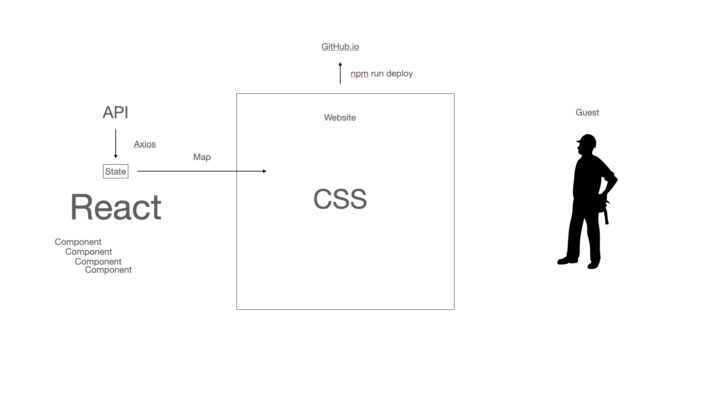

# Movie App 2021

React Js fundamentals course

- Creating component
- Resuable component
- Dynamic component
- function Map , Recap
- proptypes
- state
- component life cycle
- Fetching Api use axios
- Style css
- Deploying to
- GithubPages
- Router
- Router props

